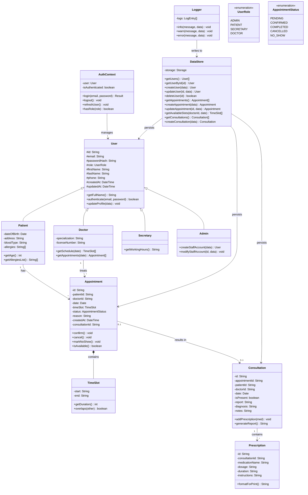
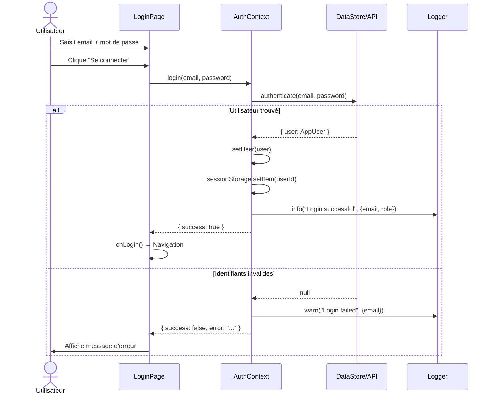
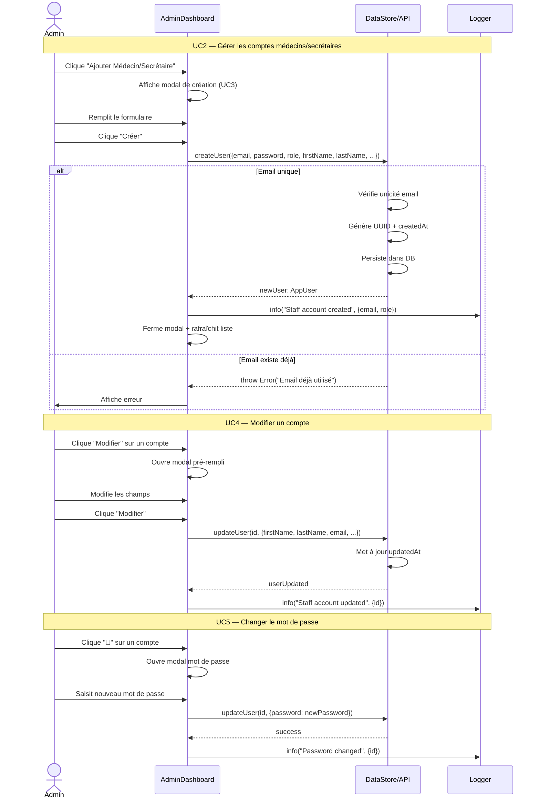
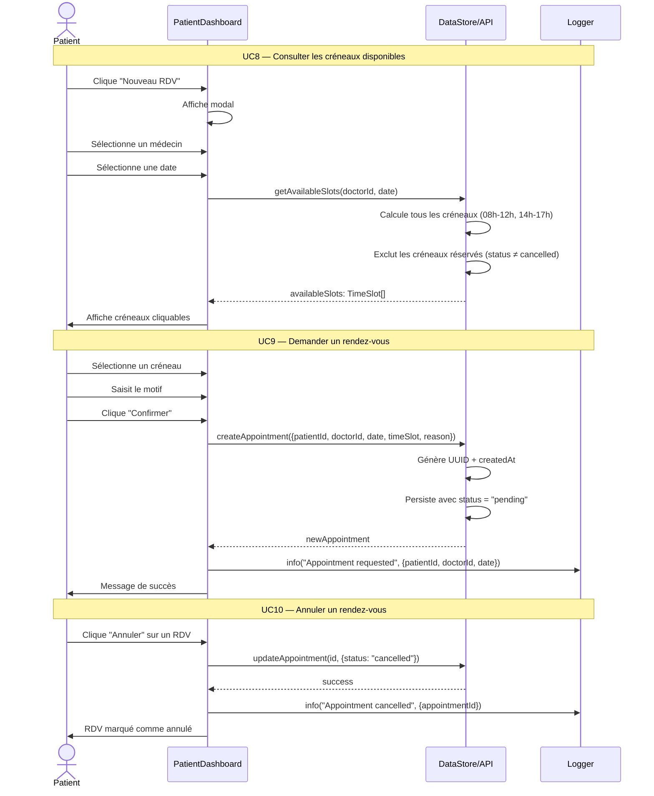
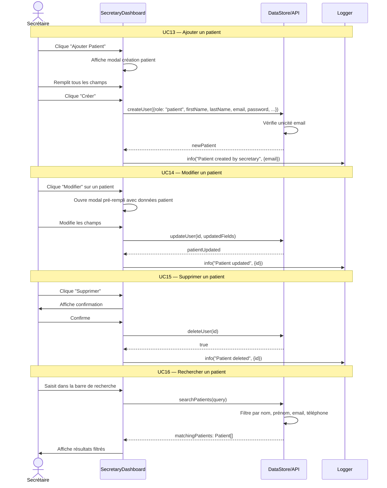
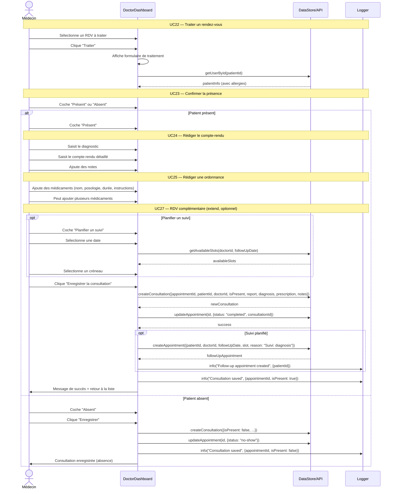
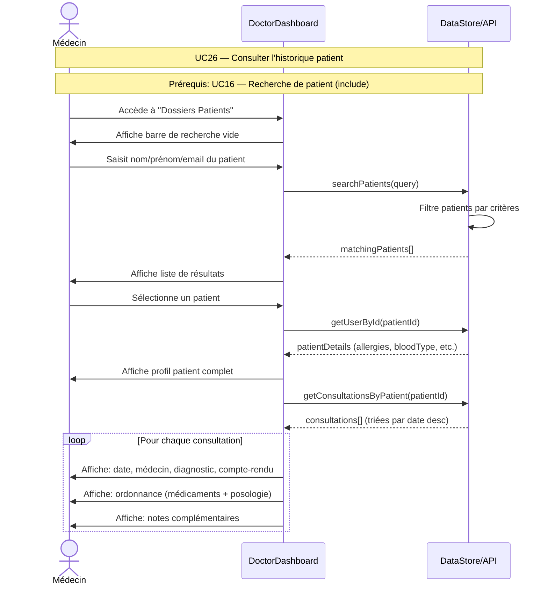

# 🏥 Conception — Application de Gestion d'un Cabinet Médical

## Document de Conception Préliminaire et Détaillée

---

## Table des Matières

1. [Diagramme de Cas d'Utilisation](#1-diagramme-de-cas-dutilisation)
2. [Diagramme de Classes](#2-diagramme-de-classes)
3. [Diagrammes de Séquences](#3-diagrammes-de-séquences)
4. [Diagramme de Composants](#4-diagramme-de-composants)
5. [Architecture Technique](#5-architecture-technique)
6. [Modèle de Données Logique](#6-modèle-de-données)
7. [Modèle Physique de Données (MPD)](#7-modèle-physique-de-données-mpd)
8. [Historique des Versions](#8-historique-des-versions)

---

## 1. Diagramme de Cas d'Utilisation

### 1.1 Vue Globale du Système

```mermaid
graph TB
    subgraph ACTEURS
        ADMIN(["👤 Admin"])
        PATIENT(["👤 Patient"])
        SECRETARY(["👤 Secrétaire"])
        DOCTOR(["👤 Médecin"])
    end

    subgraph SYSTEME["🏥 Système de Gestion du Cabinet Médical"]
        UC1["🔐 S'authentifier<br/>(UC1)"]
        
        subgraph ADMIN_UC["Espace Admin"]
            UC2["📋 Gérer les comptes<br/>médecins/secrétaires<br/>(UC2)"]
            UC3["➕ Créer un compte<br/>(UC3)"]
            UC4["✏️ Modifier un compte<br/>(UC4)"]
            UC5["🔑 Changer le mot de passe<br/>(UC5)"]
        end

        subgraph PATIENT_UC["Espace Patient"]
            UC6["📝 Créer un compte patient<br/>(UC6)"]
            UC7["📅 Gérer ses rendez-vous<br/>(UC7)"]
            UC8["🕐 Consulter les créneaux<br/>disponibles (UC8)"]
            UC9["📋 Demander un rendez-vous<br/>(UC9)"]
            UC10["❌ Annuler un rendez-vous<br/>(UC10)"]
            UC11["📄 Consulter son historique<br/>(UC11)"]
        end

        subgraph SECRETARY_UC["Espace Secrétaire"]
            UC12["👥 Gérer les patients<br/>(UC12)"]
            UC13["➕ Ajouter un patient<br/>(UC13)"]
            UC14["✏️ Modifier un patient<br/>(UC14)"]
            UC15["🗑️ Supprimer un patient<br/>(UC15)"]
            UC16["🔍 Rechercher un patient<br/>(UC16)"]
            UC17["📅 Gérer les RDV du cabinet<br/>(UC17)"]
            UC18["📊 Consulter le planning<br/>global (UC18)"]
            UC19["➕ Ajouter un RDV<br/>(UC19)"]
            UC20["✏️ Modifier un RDV<br/>(UC20)"]
            UC21["❌ Annuler un RDV<br/>(UC21)"]
        end

        subgraph DOCTOR_UC["Espace Médecin"]
            UC22["🩺 Traiter un rendez-vous<br/>(UC22)"]
            UC23["✅ Confirmer la présence<br/>(UC23)"]
            UC24["📝 Rédiger le compte-rendu<br/>(UC24)"]
            UC25["💊 Rédiger une ordonnance<br/>(UC25)"]
            UC26["📂 Consulter l'historique<br/>patient (UC26)"]
            UC27["🔄 Demander un RDV<br/>complémentaire (UC27)"]
        end
    end

    %% Relations Admin
    ADMIN -->|authentifie| UC1
    ADMIN -->|gère| UC2
    UC2 -.->|<<include>>| UC3
    UC2 -.->|<<include>>| UC4
    UC2 -.->|<<include>>| UC5

    %% Relations Patient
    PATIENT -->|s'inscrit| UC6
    PATIENT -->|authentifie| UC1
    PATIENT -->|gère| UC7
    UC7 -.->|<<include>>| UC8
    UC7 -.->|<<include>>| UC9
    UC7 -.->|<<include>>| UC10
    PATIENT -->|consulte| UC11

    %% Relations Secrétaire
    SECRETARY -->|crée compte| UC6
    SECRETARY -->|authentifie| UC1
    SECRETARY -->|gère| UC12
    UC12 -.->|<<include>>| UC13
    UC12 -.->|<<include>>| UC14
    UC12 -.->|<<include>>| UC15
    UC12 -.->|<<include>>| UC16
    SECRETARY -->|gère| UC17
    UC17 -.->|<<include>>| UC18
    UC17 -.->|<<include>>| UC19
    UC17 -.->|<<include>>| UC20
    UC17 -.->|<<include>>| UC21

    %% Relations Médecin
    DOCTOR -->|authentifie| UC1
    DOCTOR -->|consulte| UC18
    DOCTOR -->|consulte| UC26
    UC26 -.->|<<include>>| UC16
    DOCTOR -->|traite| UC22
    UC22 -.->|<<include>>| UC23
    UC22 -.->|<<include>>| UC24
    UC22 -.->|<<include>>| UC25
    UC22 -.->|<<extend>>| UC27

    style SYSTEME fill:#f0f9ff,stroke:#0284c7,stroke-width:2px
    style ADMIN_UC fill:#faf5ff,stroke:#7c3aed
    style PATIENT_UC fill:#eff6ff,stroke:#2563eb
    style SECRETARY_UC fill:#f0fdf4,stroke:#16a34a
    style DOCTOR_UC fill:#f0fdfa,stroke:#0d9488
```



### 1.2 Matrice Acteurs × Cas d'Utilisation

| Cas d'Utilisation | Admin | Patient | Secrétaire | Médecin |
|:---|:---:|:---:|:---:|:---:|
| UC1 — S'authentifier | ✅ | ✅ | ✅ | ✅ |
| UC2 — Gérer comptes médecin/sec | ✅ | | | |
| UC3 — Créer un compte | ✅ | ✅ | ✅ | |
| UC4 — Modifier un compte | ✅ | | | |
| UC5 — Changer mot de passe | ✅ | | | |
| UC6 — Créer un compte patient | | ✅ | ✅ | |
| UC7 — Gérer ses rendez-vous | | ✅ | | |
| UC8 — Consulter créneaux | | ✅ | ✅ | ✅ |
| UC9 — Demander un rendez-vous | | ✅ | ✅ | |
| UC10 — Annuler un rendez-vous | | ✅ | ✅ | |
| UC11 — Consulter son historique | | ✅ | | |
| UC12 — Gérer les patients | | | ✅ | |
| UC13-16 — CRUD + Recherche patient | | | ✅ | ✅ |
| UC17 — Gérer les RDV du cabinet | | | ✅ | |
| UC18 — Consulter le planning | | | ✅ | ✅ |
| UC19-21 — Ajouter/Modifier/Annuler RDV | | | ✅ | |
| UC22 — Traiter un rendez-vous | | | | ✅ |
| UC23 — Confirmer la présence | | | | ✅ |
| UC24 — Rédiger compte-rendu | | | | ✅ |
| UC25 — Rédiger ordonnance | | | | ✅ |
| UC26 — Consulter historique patient | | | | ✅ |
| UC27 — Demander RDV complémentaire | | | | ✅ |

### 1.3 Contraintes Structuurales

```
┌──────────────────────────────────────────────────────────┐
│                    RELATIONS « include »                   │
│                                                           │
│  UC2  ──include──► UC3, UC4, UC5                         │
│  UC7  ──include──► UC8, UC9, UC10                        │
│  UC12 ──include──► UC13, UC14, UC15, UC16                │
│  UC17 ──include──► UC18, UC19, UC20, UC21                │
│  UC22 ──include──► UC23, UC24, UC25                      │
│  UC26 ──include──► UC16 (Recherche obligatoire)           │
│                                                           │
│                    RELATIONS « extend »                    │
│                                                           │
│  UC22 ◄──extend──── UC27 (RDV complémentaire optionnel)   │
│                                                           │
│                    AUTHENTIFICATION REQUISE                │
│                                                           │
│  UC1 est prerequisite pour: UC2, UC7, UC11, UC12,        │
│  UC17, UC18, UC22, UC26                                   │
└──────────────────────────────────────────────────────────┘
```

---

## 2. Diagramme de Classes

### 2.1 Diagramme Principal



### 2.2 Classes Métier — Détail des Attributs

```
┌─────────────────────────────────────────────────────────────┐
│                         «abstract»                           │
│                          User                                 │
├─────────────────────────────────────────────────────────────┤
│ # id           : String (UUID)                               │
│ # email        : String (unique, not null)                   │
│ # passwordHash : String (bcrypt, not null)                   │
│ # role         : UserRole (enum)                             │
│ # firstName    : String (not null)                           │
│ # lastName     : String (not null)                           │
│ # phone        : String                                      │
│ # createdAt    : DateTime                                    │
│ # updatedAt    : DateTime                                    │
├─────────────────────────────────────────────────────────────┤
│ + getFullName() : String                                     │
│ + authenticate(email, password) : boolean                    │
│ + updateProfile(data: Partial<User>) : void                  │
└──────────────────────────┬──────────────────────────────────┘
                           │
          ┌────────────────┼────────────────┬──────────────┐
          ▼                ▼                ▼              ▼
   ┌─────────────┐ ┌─────────────┐ ┌─────────────┐ ┌──────────┐
   │   Patient    │ │   Doctor    │ │  Secretary  │ │  Admin   │
   ├─────────────┤ ├─────────────┤ ├─────────────┤ ├──────────┤
   │ dateOfBirth │ │specializ.   │ │             │ │          │
   │ address     │ │licenseNum.  │ │             │ │          │
   │ bloodType   │ └─────────────┘ └─────────────┘ └──────────┘
   │ allergies[] │
   └─────────────┘
```

---

## 3. Diagrammes de Séquences

### 3.1 Authentification (UC1)



### 3.2 Gestion des Comptes Personnel (UC2-5) — Admin



### 3.3 Gestion des Rendez-vous — Patient (UC7-10)



### 3.4 Gestion des Patients — Secrétaire (UC12-16)



### 3.5 Traitement d'un Rendez-vous — Médecin (UC22-25, UC27)



### 3.6 Consultation de l'Historique Patient — Médecin (UC26)



---

## 4. Diagramme de Composants

### 4.1 Architecture Globale des Composants

```mermaid
graph TB
    subgraph FRONTEND["⚛️ Frontend React"]
        direction TB

        subgraph CORE["Shared / Core"]
            AUTH["AuthContext<br/>🔐 Gestion auth"]
            STORE["DataStore<br/>💾 Persistence"]
            API["API Layer<br/>🌐 HTTP Client"]
            LOG["Logger<br/>📋 Logging"]
            TYPES["Types<br/>📐 TypeScript"]
        end

        subgraph COMPONENTS["UI Components"]
            LAYOUT["Layout<br/>🖼️ Sidebar + Header"]
        end

        subgraph FEATURES["Feature Modules"]
            direction TB
            
            subgraph AUTH_FEAT["Auth"]
                LOGIN["LoginPage<br/>🔑 Connexion/Inscription"]
            end

            subgraph ADMIN_FEAT["Admin"]
                ADMIN_D["AdminDashboard<br/>⚙️ Gestion Personnel"]
            end

            subgraph PATIENT_FEAT["Patient"]
                PAT_D["PatientDashboard<br/>📊 Dashboard"]
                PAT_APT["Mes Rendez-vous<br/>📅 UC7-10"]
                PAT_HIST["Mon Historique<br/>📄 UC11"]
            end

            subgraph SECRETARY_FEAT["Secrétaire"]
                SEC_D["SecretaryDashboard<br/>📊 Dashboard"]
                SEC_PAT["Gestion Patients<br/>👥 UC12-16"]
                SEC_PLAN["Planning RDV<br/>📋 UC17-21"]
            end

            subgraph DOCTOR_FEAT["Médecin"]
                DOC_D["DoctorDashboard<br/>📊 Dashboard"]
                DOC_PLAN["Mon Planning<br/>📅 UC18"]
                DOC_TREAT["Traiter RDV<br/>🩺 UC22-25,27"]
                DOC_HIST["Dossiers Patients<br/>📂 UC26"]
            end
        end
    end

    subgraph BACKEND["🖥️ Backend API (Node.js/Express)"]
        REST["REST API<br/>Port 3001"]
        MW_AUTH["Middleware JWT"]
        MW_ROLE["Middleware Rôles"]
        ROUTES["Routes<br/>auth, users, patients,<br/>appointments, consultations"]
    end

    subgraph DATABASE["🗄️ MySQL 8.0"]
        DB["cabinet_medical"]
        T_USERS["users"]
        T_PATIENT["patient_details"]
        T_DOCTOR["doctor_details"]
        T_APT["appointments"]
        T_CONS["consultations"]
        T_RX["prescriptions"]
        T_LOG["audit_log"]
    end

    %% Frontend internal connections
    LOGIN --> AUTH
    ADMIN_D --> STORE
    PAT_D --> STORE
    PAT_APT --> STORE
    PAT_HIST --> STORE
    SEC_D --> STORE
    SEC_PAT --> STORE
    SEC_PLAN --> STORE
    DOC_D --> STORE
    DOC_PLAN --> STORE
    DOC_TREAT --> STORE
    DOC_HIST --> STORE
    
    AUTH --> STORE
    STORE -.->|mode démo| CORE
    API -.->|mode production| REST
    
    LAYOUT --> AUTH

    %% Backend connections
    REST --> MW_AUTH --> MW_ROLE --> ROUTES
    ROUTES --> DB

    %% Database relations
    DB --> T_USERS
    DB --> T_PATIENT
    DB --> T_DOCTOR
    DB --> T_APT
    DB --> T_CONS
    DB --> T_RX
    DB --> T_LOG

    style FRONTEND fill:#eff6ff,stroke:#2563eb,stroke-width:2px
    style BACKEND fill:#fef3c7,stroke:#d97706,stroke-width:2px
    style DATABASE fill:#ecfdf5,stroke:#059669,stroke-width:2px
    style CORE fill:#f0f9ff,stroke:#0284c7
    style FEATURES fill:#faf5ff,stroke:#7c3aed
```



### 4.2 Hiérarchie des Composants React

```
App
├── AuthProvider (Context)
│   └── AppContent
│       ├── LoginPage (si non authentifié)
│       │   ├── Formulaire Connexion
│       │   └── Formulaire Inscription Patient (UC6)
│       │
│       └── Layout (si authentifié)
│           ├── Sidebar (navigation par rôle)
│           │   ├── Menu items (dynamique selon rôle)
│           │   └── User info + Déconnexion
│           ├── Header
│           └── Main Content
│               │
│               ├── [Admin]
│               │   ├── Dashboard (statistiques)
│               │   ├── AdminDashboard (doctors)
│               │   │   ├── Liste des médecins
│               │   │   ├── Modal Créer/Modifier médecin
│               │   │   └── Modal Changer mot de passe
│               │   └── AdminDashboard (secretaries)
│               │       ├── Liste des secrétaires
│               │       └── Modal Créer/Modifier secrétaire
│               │
│               ├── [Patient]
│               │   ├── Dashboard (stats + RDV à venir)
│               │   ├── Appointments (UC7)
│               │   │   ├── Liste des rendez-vous
│               │   │   ├── Bouton Annuler (UC10)
│               │   │   └── Modal Nouveau RDV
│               │   │       ├── Sélection médecin + date
│               │   │       ├── Grille créneaux (UC8)
│               │   │       └── Confirmation (UC9)
│               │   └── History (UC11)
│               │       └── Liste consultations + ordonnances
│               │
│               ├── [Secrétaire]
│               │   ├── Dashboard (stats + RDV du jour)
│               │   ├── Patients (UC12-16)
│               │   │   ├── Barre de recherche (UC16)
│               │   │   ├── Tableau des patients
│               │   │   ├── Modal CRUD Patient (UC13-15)
│               │   │   └── Confirmation suppression
│               │   └── Planning (UC17-21)
│               │       ├── Liste globale des RDV (UC18)
│               │       ├── Boutons Confirmer/Annuler
│               │       └── Modal CRUD RDV (UC19-21)
│               │
│               └── [Médecin]
│                   ├── Dashboard (stats + consultations du jour)
│                   │   └── Accès rapide "Traiter"
│                   ├── Planning (UC18)
│                   │   └── Liste des RDV futurs
│                   ├── Treat Appointment (UC22-25, UC27)
│                   │   ├── Info patient + allergies
│                   │   ├── Section Présence (UC23)
│                   │   ├── Section Compte-rendu (UC24)
│                   │   │   ├── Diagnostic
│                   │   │   └── Rapport détaillé
│                   │   ├── Section Ordonnance (UC25)
│                   │   │   └── Médicaments dynamiques
│                   │   └── Section Suivi optionnel (UC27)
│                   │       ├── Date + créneau
│                   │       └── Création automatique
│                   └── Patient History (UC26)
│                       ├── Recherche patient (UC16)
│                       └── Historique consultations
```

### 4.3 Diagramme de Déploiement

```
┌─────────────────────────────────────────────────────────┐
│                    NAVIGATEUR WEB                         │
│  ┌────────────────────────────────────────────────────┐  │
│  │           React SPA (Build Production)              │  │
│  │                                                      │  │
│  │  ┌──────────┐  ┌──────────┐  ┌──────────┐         │  │
│  │  │  Auth    │  │  Pages   │  │  Shared  │         │  │
│  │  │ Context  │  │ (Routes) │  │  Store   │         │  │
│  │  └────┬─────┘  └────┬─────┘  └────┬─────┘         │  │
│  │       │              │              │               │  │
│  │       └──────────────┼──────────────┘               │  │
│  │                      │                              │  │
│  │              ┌───────┴───────┐                      │  │
│  │              │  LocalStorage │ (mode démo)          │  │
│  │              └───────────────┘                      │  │
│  └────────────────────────┬───────────────────────────┘  │
└───────────────────────────┼──────────────────────────────┘
                            │ HTTP/REST (optionnel)
                            ▼
┌─────────────────────────────────────────────────────────┐
│              SERVEUR NODE.JS (Optionnel)                  │
│  ┌──────────┐  ┌──────────┐  ┌──────────┐              │
│  │  Express  │  │   JWT    │  │   CORS   │              │
│  │  Routes   │  │   Auth   │  │  Config  │              │
│  └────┬─────┘  └──────────┘  └──────────┘              │
│       │                                                  │
│       │ mysql2/promise                                   │
│       ▼                                                  │
│  ┌──────────────────────────────────────────────────┐   │
│  │              Connection Pool (10 connexions)       │   │
│  └────────────────────┬─────────────────────────────┘   │
└───────────────────────┼─────────────────────────────────┘
                        │ TCP/IP (Port 3306)
                        ▼
┌─────────────────────────────────────────────────────────┐
│                  MySQL 8.0 SERVER                         │
│  ┌──────────────────────────────────────────────────┐   │
│  │          Database: cabinet_medical                 │   │
│  │                                                    │   │
│  │  ┌─────────┐ ┌──────────┐ ┌──────────────┐      │   │
│  │  │  users  │ │appointm. │ │ consultations│      │   │
│  │  └─────────┘ └──────────┘ └──────────────┘      │   │
│  │  ┌──────────┐ ┌──────────┐ ┌──────────────┐      │   │
│  │  │patient_  │ │doctor_   │ │prescriptions │      │   │
│  │  │details   │ │details   │ │              │      │   │
│  │  └──────────┘ └──────────┘ └──────────────┘      │   │
│  │  ┌──────────┐                                    │   │
│  │  │audit_log │                                    │   │
│  │  └──────────┘                                    │   │
│  └──────────────────────────────────────────────────┘   │
└─────────────────────────────────────────────────────────┘
```

---

## 5. Architecture Technique

### 5.1 Stack Technologique

| Couche | Technologie | Version |
|--------|------------|---------|
| Frontend | React | 19.2 |
| Language | TypeScript | 5.9 |
| Build | Vite | 7.3 |
| Styles | Tailwind CSS | 4.1 |
| Icons | Lucide React | latest |
| Backend (optionnel) | Node.js + Express | 18+ / 4.x |
| Database | MySQL | 8.0 |
| Auth | JWT + bcrypt | — |
| Logging | Custom async logger | — |

### 5.2 Patterns Architecturaux

```
┌─────────────────────────────────────────┐
│         PATTERNS UTILISÉS               │
├─────────────────────────────────────────┤
│                                         │
│  1. Feature-Based Architecture          │
│     src/features/{domain}/              │
│                                         │
│  2. Context Provider Pattern            │
│     AuthContext (état global)           │
│                                         │
│  3. Repository Pattern                  │
│     DataStore (abstraction persistence) │
│                                         │
│  4. Strategy Pattern                    │
│     LocalStorage vs API (switch)        │
│                                         │
│  5. Role-Based Access Control           │
│     Navigation + vues par rôle          │
│                                         │
│  6. Observer Pattern (React)            │
│     useState + re-renders auto          │
│                                         │
└─────────────────────────────────────────┘
```

### 5.3 Flux de Données

```
User Action
    │
    ▼
Component (React)
    │
    ├──► AuthContext (si auth)
    │        │
    │        ▼
    │    DataStore ←──── LocalStorage (démo)
    │        │
    │        ▼
    │    Logger (async)
    │
    └──► API Layer (si production)
              │
              ▼
         REST Backend
              │
              ▼
          MySQL DB
```

---

## 6. Modèle de Données

### 6.1 Schéma Relationnel

```
┌───────────────────────────────────────────────┐
│                   users                        │
│═══════════════════════════════════════════════ │
│ PK  id              VARCHAR(36)                │
│     email           VARCHAR(255) UNIQUE        │
│     password_hash   VARCHAR(255)               │
│     role            ENUM(admin,patient,sec,doc)│
│     first_name      VARCHAR(100)               │
│     last_name       VARCHAR(100)               │
│     phone           VARCHAR(20)                │
│     created_at      DATETIME                   │
│     updated_at      DATETIME                   │
└───────────┬───────────────────┬───────────────┘
            │ 1                 │ 1
            │                   │
    ┌───────┴──────┐    ┌──────┴─────────┐
    ▼              │    ▼                │
┌────────────┐    │  ┌──────────────┐   │
│patient_    │    │  │doctor_       │   │
│details     │    │  │details       │   │
│════════════│    │  │══════════════│   │
│PK user_id  │    │  │PK user_id    │   │
│   date_of_ │    │  │   specializ. │   │
│   birth    │    │  │   license_   │   │
│   address  │    │  │   number     │   │
│   blood_   │    │  └──────────────┘   │
│   type     │    │                      │
│   allergies│    │                      │
│   (JSON)   │    │                      │
└────────────┘    │                      │
                  │                      │
            ┌─────┴──────────────────────┴──────┐
            │                                     │
            │ FK patient_id              FK doctor_id
            ▼                                     ▼
┌───────────────────────────────────────────────────┐
│                   appointments                     │
│═══════════════════════════════════════════════════ │
│ PK  id              VARCHAR(36)                    │
│ FK  patient_id      VARCHAR(36) → users.id         │
│ FK  doctor_id       VARCHAR(36) → users.id         │
│     date            DATE                            │
│     start_time      TIME                            │
│     end_time        TIME                            │
│     status          ENUM(pending,confirmed,         │
│                         completed,cancelled,no-show)│
│     reason          VARCHAR(500)                    │
│ FK  consultation_id VARCHAR(36) → consultations.id │
│     created_at      DATETIME                        │
│     updated_at      DATETIME                        │
│                                                    │
│ UNIQUE(doctor_id, date, start_time)                │
└───────────┬───────────────────────────────────────┘
            │ 1
            │
            ▼ 0..1
┌───────────────────────────────────────────────────┐
│                   consultations                    │
│═══════════════════════════════════════════════════ │
│ PK  id              VARCHAR(36)                    │
│ FK  appointment_id  VARCHAR(36) → appointments.id  │
│ FK  patient_id      VARCHAR(36) → users.id         │
│ FK  doctor_id       VARCHAR(36) → users.id         │
│     date            DATE                            │
│     is_present      BOOLEAN                         │
│     report          TEXT                            │
│     diagnosis       VARCHAR(500)                    │
│     notes           TEXT                            │
│     created_at      DATETIME                        │
└───────────┬───────────────────────────────────────┘
            │ 1
            │
            ▼ 0..*
┌───────────────────────────────────────────────────┐
│                   prescriptions                    │
│═══════════════════════════════════════════════════ │
│ PK  id                  VARCHAR(36)                │
│ FK  consultation_id     VARCHAR(36)                │
│     medication_name     VARCHAR(200)               │
│     dosage              VARCHAR(100)               │
│     duration            VARCHAR(100)               │
│     instructions        TEXT                        │
└───────────────────────────────────────────────────┘
```

### 6.2 Règles Métier

```
╔══════════════════════════════════════════════════════════════╗
║                    RÈGLES DE GESTION                         ║
╠══════════════════════════════════════════════════════════════╣
║                                                              ║
║  R1: Authentification obligatoire avant toute action         ║
║      Sauf: Inscription patient (UC6)                         ║
║                                                              ║
║  R2: Unicité de l'email pour chaque compte                  ║
║                                                              ║
║  R3: Un créneau ne peut être réservé qu'une seule fois      ║
║      Contrainte: UNIQUE(doctor_id, date, start_time)        ║
║                                                              ║
║  R4: Seul l'Admin peut créer/modifier les comptes           ║
║      médecins et secrétaires                                 ║
║                                                              ║
║  R5: L'Admin n'a PAS accès aux dossiers patients            ║
║      (séparation stricte des responsabilités)                ║
║                                                              ║
║  R6: Un compte patient peut être créé par:                  ║
║      - Le patient lui-même (formulaire public)               ║
║      - La secrétaire (formulaire interne)                    ║
║                                                              ║
║  R7: Un rendez-vous ne peut être annulé que si              ║
║      status ∈ {pending, confirmed}                           ║
║                                                              ║
║  R8: Le traitement d'un RDV (UC22) génère                   ║
║      automatiquement une consultation avec:                  ║
║      - Confirmation de présence (UC23)                       ║
║      - Compte-rendu (UC24)                                   ║
║      - Ordonnance optionnelle (UC25)                         ║
║      - RDV complémentaire optionnel (UC27)                   ║
║                                                              ║
║  R9: La consultation de l'historique patient (UC26)         ║
║      passe obligatoirement par une recherche (UC16)          ║
║                                                              ║
║  R10: Les créneaux de consultation sont:                     ║
║      Matin: 08:00 - 12:00 (tranches de 30 min)              ║
║      Après-midi: 14:00 - 17:00 (tranches de 30 min)         ║
║      Soit 14 créneaux par jour par médecin                   ║
║                                                              ║
╚══════════════════════════════════════════════════════════════╝
```

---

## 7. Modèle Physique de Données (MPD)

> Le Modèle Physique de Données décrit l'implémentation concrète des tables dans la base MySQL, incluant les types de données, les contraintes d'intégrité, les index et les relations entre tables.

### 7.1 Schéma Relationnel Physique (Diagramme)

```
┌─────────────────────────────────────────────────────────────┐
│                          users                               │
│═════════════════════════════════════════════════════════════  │
│ PK   id                VARCHAR(36)      NOT NULL             │
│      email             VARCHAR(255)     NOT NULL  UNIQUE    │
│      password_hash     VARCHAR(255)     NOT NULL             │
│      role              ENUM('admin','patient',              │
│                          'secretary','doctor')  NOT NULL     │
│      first_name        VARCHAR(100)     NOT NULL             │
│      last_name         VARCHAR(100)     NOT NULL             │
│      phone             VARCHAR(20)      DEFAULT ''          │
│      created_at        DATETIME         NOT NULL  DEFAULT    │
│                                          CURRENT_TIMESTAMP   │
│      updated_at        DATETIME         NOT NULL  DEFAULT    │
│                                          CURRENT_TIMESTAMP   │
│                                          ON UPDATE           │
│                                                              │
│ INDEX  idx_users_email  (email)                              │
│ INDEX  idx_users_role   (role)                               │
│ INDEX  idx_users_name   (last_name, first_name)              │
└──────────┬──────────────────────┬───────────────────────────┘
           │ 1                    │ 1
           │                      │
     ┌─────┴──────┐        ┌─────┴──────┐
     ▼            │        ▼            │
┌──────────────┐  │  ┌──────────────┐   │
│patient_      │  │  │doctor_       │   │
│details       │  │  │details       │   │
│══════════════│  │  │══════════════│   │
│PK user_id    │  │  │PK user_id    │   │
│   date_of_   │  │  │   specializ. │   │
│   birth  DATE│  │  │   VARCHAR    │   │
│              │  │  │              │   │
│   address    │  │  │              │   │
│   TEXT       │  │  │              │   │
│              │  │  │              │   │
│   blood_type │  │  │              │   │
│   VARCHAR(5) │  │  │              │   │
│              │  │  │              │   │
│   allergies  │  │  │              │   │
│   JSON       │  │  │              │   │
│              │  │  │              │   │
│FK user_id ──►│  │  │FK user_id ──►│   │
│   users(id)  │  │  │   users(id)  │   │
│   ON DELETE  │  │  │   ON DELETE  │   │
│   CASCADE    │  │  │   CASCADE    │   │
└──────────────┘  │  └──────────────┘   │
                  │                      │
           ┌──────┴──────────────────────┴──────────┐
           │                                         │
           │ FK patient_id               FK doctor_id
           ▼                                         ▼
┌───────────────────────────────────────────────────────────┐
│                       appointments                         │
│═══════════════════════════════════════════════════════════  │
│ PK   id                VARCHAR(36)      NOT NULL             │
│ FK   patient_id        VARCHAR(36)      NOT NULL             │
│ FK   doctor_id         VARCHAR(36)      NOT NULL             │
│      date              DATE            NOT NULL             │
│      start_time        TIME            NOT NULL             │
│      end_time          TIME            NOT NULL             │
│      status            ENUM('pending', 'confirmed',          │
│                            'completed', 'cancelled',        │
│                            'no-show')  NOT NULL DEFAULT     │
│                                            'pending'        │
│      reason            VARCHAR(500)     DEFAULT ''          │
│      created_at        DATETIME         DEFAULT             │
│                                          CURRENT_TIMESTAMP  │
│      updated_at        DATETIME         DEFAULT             │
│                                          CURRENT_TIMESTAMP  │
│                                          ON UPDATE          │
│      consultation_id   VARCHAR(36)      DEFAULT NULL         │
│                                                             │
│ FK   patient_id  → users(id)      ON DELETE RESTRICT        │
│ FK   doctor_id   → users(id)      ON DELETE RESTRICT        │
│                                                             │
│ INDEX  idx_apt_date         (date)                          │
│ INDEX  idx_apt_doctor_date  (doctor_id, date)               │
│ INDEX  idx_apt_patient      (patient_id)                    │
│ UNIQUE idx_apt_slot         (doctor_id, date, start_time)   │
└──────────┬──────────────────────────────────────────────────┘
           │ 1
           │
           ▼ 0..1
┌───────────────────────────────────────────────────────────┐
│                       consultations                         │
│═══════════════════════════════════════════════════════════  │
│ PK   id                VARCHAR(36)      NOT NULL             │
│ FK   appointment_id    VARCHAR(36)      NOT NULL             │
│ FK   patient_id        VARCHAR(36)      NOT NULL             │
│ FK   doctor_id         VARCHAR(36)      NOT NULL             │
│      date              DATE            NOT NULL             │
│      is_present        BOOLEAN         NOT NULL DEFAULT TRUE │
│      report            TEXT                                  │
│      diagnosis         VARCHAR(500)                          │
│      notes             TEXT                                  │
│      created_at        DATETIME        DEFAULT              │
│                                          CURRENT_TIMESTAMP  │
│                                                             │
│ FK   appointment_id → appointments(id) ON DELETE CASCADE    │
│ FK   patient_id     → users(id)        ON DELETE RESTRICT   │
│ FK   doctor_id      → users(id)        ON DELETE RESTRICT   │
│                                                             │
│ INDEX  idx_cons_patient (patient_id)                        │
│ INDEX  idx_cons_doctor  (doctor_id)                         │
│ INDEX  idx_cons_date    (date)                              │
└──────────┬──────────────────────────────────────────────────┘
           │ 1
           │
           ▼ 0..*
┌───────────────────────────────────────────────────────────┐
│                       prescriptions                         │
│═══════════════════════════════════════════════════════════  │
│ PK   id                    VARCHAR(36)    NOT NULL           │
│ FK   consultation_id       VARCHAR(36)    NOT NULL           │
│      medication_name       VARCHAR(200)   NOT NULL           │
│      dosage                VARCHAR(100)   DEFAULT ''        │
│      duration              VARCHAR(100)   DEFAULT ''        │
│      instructions          TEXT                              │
│                                                             │
│ FK   consultation_id → consultations(id) ON DELETE CASCADE  │
│                                                             │
│ INDEX  idx_rx_consultation (consultation_id)                │
└───────────────────────────────────────────────────────────┘
```

### 7.2 Description Détaillée des Tables

#### Table `users`

| Colonne | Type | Contraintes | Description |
|---------|------|-------------|-------------|
| `id` | `VARCHAR(36)` | PK, NOT NULL | UUID v4 généré par `crypto.randomUUID()` |
| `email` | `VARCHAR(255)` | NOT NULL, UNIQUE | Identifiant de connexion |
| `password_hash` | `VARCHAR(255)` | NOT NULL | Mot de passe haché via `bcryptjs` (10 salt rounds) |
| `role` | `ENUM('admin','patient','secretary','doctor')` | NOT NULL | Rôle pour le contrôle d'accès |
| `first_name` | `VARCHAR(100)` | NOT NULL | Prénom |
| `last_name` | `VARCHAR(100)` | NOT NULL | Nom de famille |
| `phone` | `VARCHAR(20)` | DEFAULT `''` | Numéro de téléphone |
| `created_at` | `DATETIME` | NOT NULL, DEFAULT `CURRENT_TIMESTAMP` | Date de création du compte |
| `updated_at` | `DATETIME` | NOT NULL, DEFAULT `CURRENT_TIMESTAMP ON UPDATE` | Dernière modification |

> **Note** : La table `users` utilise le pattern **Single Table Inheritance** — tous les rôles partagent la même table. Les informations spécifiques à chaque rôle sont stockées dans les tables `patient_details` et `doctor_details`.

#### Table `patient_details`

| Colonne | Type | Contraintes | Description |
|---------|------|-------------|-------------|
| `user_id` | `VARCHAR(36)` | PK, FK → `users(id) ON DELETE CASCADE` | Référence vers l'utilisateur |
| `date_of_birth` | `DATE` | NULL | Date de naissance |
| `address` | `TEXT` | NULL | Adresse postale complète |
| `blood_type` | `VARCHAR(5)` | NULL | Groupe sanguin (A+, A-, B+, B-, AB+, AB-, O+, O-) |
| `allergies` | `JSON` | NULL | Liste des allergies (ex: `["Pénicilline","Aspirine"]`) |

> **Contrainte** : La suppression d'un utilisateur cascade automatiquement la suppression de ses détails patient.

#### Table `doctor_details`

| Colonne | Type | Contraintes | Description |
|---------|------|-------------|-------------|
| `user_id` | `VARCHAR(36)` | PK, FK → `users(id) ON DELETE CASCADE` | Référence vers l'utilisateur |
| `specialization` | `VARCHAR(200)` | DEFAULT `'Médecine Générale'` | Spécialité médicale |

#### Table `appointments`

| Colonne | Type | Contraintes | Description |
|---------|------|-------------|-------------|
| `id` | `VARCHAR(36)` | PK, NOT NULL | UUID |
| `patient_id` | `VARCHAR(36)` | FK → `users(id) ON DELETE RESTRICT` | Patient associé |
| `doctor_id` | `VARCHAR(36)` | FK → `users(id) ON DELETE RESTRICT` | Médecin associé |
| `date` | `DATE` | NOT NULL | Date du rendez-vous |
| `start_time` | `TIME` | NOT NULL | Heure de début |
| `end_time` | `TIME` | NOT NULL | Heure de fin |
| `status` | `ENUM('pending','confirmed','completed','cancelled','no-show')` | NOT NULL, DEFAULT `'pending'` | État du rendez-vous |
| `reason` | `VARCHAR(500)` | DEFAULT `''` | Motif de la consultation |
| `created_at` | `DATETIME` | DEFAULT `CURRENT_TIMESTAMP` | Date de création |
| `updated_at` | `DATETIME` | DEFAULT `CURRENT_TIMESTAMP ON UPDATE` | Dernière modification |
| `consultation_id` | `VARCHAR(36)` | NULL | Lien vers la consultation (après traitement) |

> **Contrainte UNIQUE** `idx_apt_slot(doctor_id, date, start_time)` : Empêche le chevauchement des créneaux pour un même médecin.

#### Table `consultations`

| Colonne | Type | Contraintes | Description |
|---------|------|-------------|-------------|
| `id` | `VARCHAR(36)` | PK, NOT NULL | UUID |
| `appointment_id` | `VARCHAR(36)` | FK → `appointments(id) ON DELETE CASCADE` | RDV associé |
| `patient_id` | `VARCHAR(36)` | FK → `users(id) ON DELETE RESTRICT` | Patient |
| `doctor_id` | `VARCHAR(36)` | FK → `users(id) ON DELETE RESTRICT` | Médecin |
| `date` | `DATE` | NOT NULL | Date de la consultation |
| `is_present` | `BOOLEAN` | NOT NULL, DEFAULT `TRUE` | Le patient était-il présent ? |
| `report` | `TEXT` | NULL | Compte-rendu médical détaillé |
| `diagnosis` | `VARCHAR(500)` | NULL | Diagnostic posé |
| `notes` | `TEXT` | NULL | Notes complémentaires |
| `created_at` | `DATETIME` | DEFAULT `CURRENT_TIMESTAMP` | Date de création |

#### Table `prescriptions`

| Colonne | Type | Contraintes | Description |
|---------|------|-------------|-------------|
| `id` | `VARCHAR(36)` | PK, NOT NULL | UUID |
| `consultation_id` | `VARCHAR(36)` | FK → `consultations(id) ON DELETE CASCADE` | Consultation associée |
| `medication_name` | `VARCHAR(200)` | NOT NULL | Nom du médicament |
| `dosage` | `VARCHAR(100)` | DEFAULT `''` | Posologie (ex: "1g", "5mg") |
| `duration` | `VARCHAR(100)` | DEFAULT `''` | Durée du traitement |
| `instructions` | `TEXT` | NULL | Instructions de prise |

#### Table `audit_log`

| Colonne | Type | Contraintes | Description |
|---------|------|-------------|-------------|
| `id` | `BIGINT` | PK, AUTO_INCREMENT | Identifiant auto |
| `timestamp` | `DATETIME` | NOT NULL, DEFAULT `CURRENT_TIMESTAMP` | Horodatage |
| `level` | `ENUM('INFO','WARN','ERROR')` | NOT NULL, DEFAULT `'INFO'` | Niveau de sévérité |
| `user_id` | `VARCHAR(36)` | NULL | Utilisateur concerné |
| `action` | `VARCHAR(100)` | NOT NULL | Action effectuée |
| `details` | `JSON` | NULL | Détails supplémentaires |
| `ip_address` | `VARCHAR(45)` | NULL | Adresse IP (IPv4/IPv6) |

### 7.3 Diagramme des Cardinalités

```
                    ┌──────────┐
                    │  users   │
                    └────┬─────┘
                         │
          ┌──────────────┼──────────────┐
          │              │              │
     1..1 ┤         0..* ├         0..* ├
          │              │              │
    ┌─────┴─────┐  ┌─────┴─────┐  ┌─────┴─────┐
    │ patient_  │  │appointments│  │consultations│
    │ details   │  │           │  │            │
    └───────────┘  └─────┬─────┘  └──────┬─────┘
                        │               │
                   0..* ├          1..* ├
                        │               │
                  ┌─────┴────┐    ┌─────┴──────┐
                  │ users    │    │prescriptions│
                  │(doctor)  │    │            │
                  └──────────┘    └────────────┘

    ┌──────────┐      1      ┌──────────────┐
    │  users   │◄────────────│   users      │
    │          │             │ (patient)    │
    └──────────┘             └──────────────┘
         ▲                         │
         │ 0..* (doctor_id)        │ 0..* (patient_id)
         │                         │
         └─────────┌───────────────┘
                   │
             ┌─────┴─────┐
             │appointments│
             └───────────┘
```

### 7.4 Contraintes d'Intégrité

| Règle | Type | Description |
|-------|------|-------------|
| `UNIQUE(email)` | Unicité | Un email ne peut exister qu'une seule fois |
| `UNIQUE(doctor_id, date, start_time)` | Unicité composite | Pas de chevauchement de créneaux |
| `FK patient_details.user_id → users(id) CASCADE` | Intégrité référentielle | Suppression en cascade |
| `FK appointments.patient_id → users(id) RESTRICT` | Intégrité référentielle | Impossible de supprimer un patient avec des RDV |
| `FK appointments.doctor_id → users(id) RESTRICT` | Intégrité référentielle | Impossible de supprimer un médecin avec des RDV |
| `FK consultations.appointment_id → appointments(id) CASCADE` | Intégrité référentielle | Suppression en cascade |
| `FK prescriptions.consultation_id → consultations(id) CASCADE` | Intégrité référentielle | Suppression en cascade |

### 7.5 Stratégie de Hachage des Mots de Passe

```
┌───────────────┐         bcryptjs          ┌──────────────────┐
│ Mot de passe  │  ────── hashSync() ─────►  │ password_hash    │
│ en clair      │    (10 salt rounds)        │ VARCHAR(255)     │
└───────────────┘                            │ $2b$10$...       │
                                             └──────────────────┘

┌───────────────┐         bcryptjs          ┌──────────────────┐
│ Login: mdp    │  ────── compare() ──────►  │ Comparaison avec │
│ saisi         │    hash + salt             │ hash stocké      │
└───────────────┘                            └──────────────────┘
```

- **Hachage** : `bcryptjs.hashSync(password, 10)` — 10 rounds de sel
- **Vérification** : `bcryptjs.compare(password, storedHash)` — temps constant
- **Stockage** : Le hash complet (incluant sel + coût) est stocké dans `password_hash`

### 7.6 Mapping Physique → Logique (Backend)

Le backend Express transforme les colonnes MySQL `snake_case` en propriétés TypeScript `camelCase` avant d'envoyer le JSON au frontend :

```
Colonne MySQL              Propriété TypeScript
─────────────────────────────────────────────────
user_id           ──►      userId
first_name        ──►      firstName
last_name         ──►      lastName
password_hash     ──►      (supprimé par safeUser)
date_of_birth     ──►      dateOfBirth
blood_type        ──►      bloodType
start_time        ──►      timeSlot.start
end_time          ──►      timeSlot.end
is_present        ──►      isPresent (boolean)
created_at        ──►      createdAt
updated_at        ──►      updatedAt
consultation_id   ──►      consultationId
```

---

## 8. Historique des Versions

| Version | Date | Description |
|---------|------|-------------|
| 1.0 | 2025 | Conception initiale — 27 cas d'utilisation, 4 acteurs |
| 1.1 | 2025 | Ajout du Modèle Physique de Données (MPD), architecture Full-Stack Express+MySQL |

---

> **Note:** Les diagrammes Mermaid peuvent être visualisés directement dans GitHub, VS Code (extension Mermaid), ou tout outil compatible.
